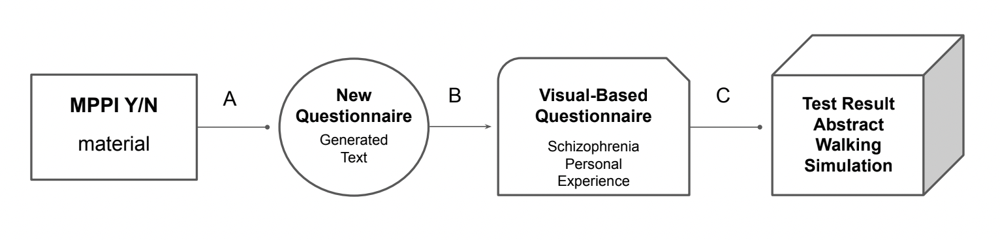
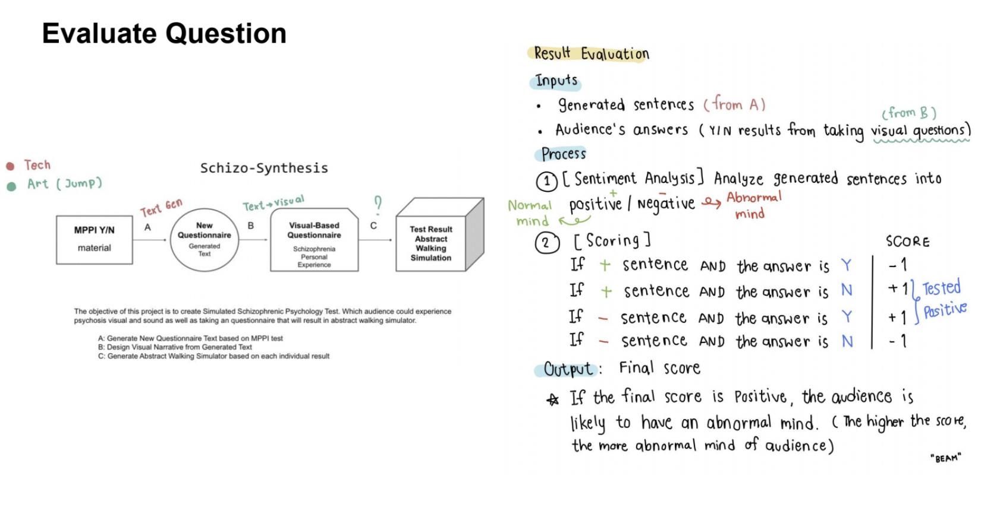
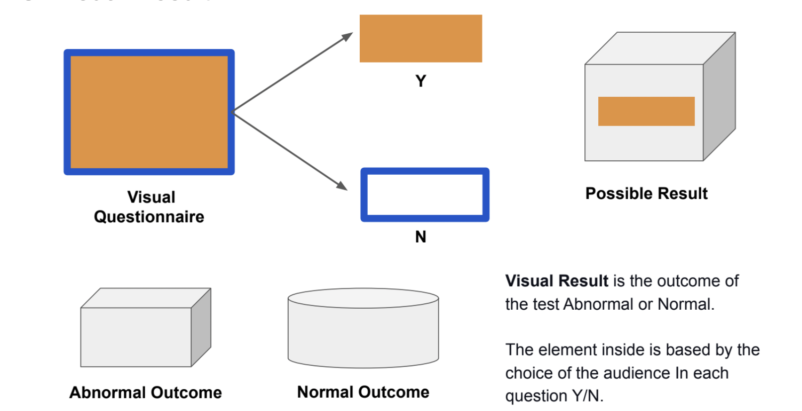

# Schizo-Synthesis

The objective of this project is to create Simulated Schizophrenic Psychology Test. Which audience could experience psychosis visual and sound as well as taking an questionnaire that will result in abstract walking simulator.

A: Generate New Questionnaire Text based on MPPI test \
B: Design Visual Narrative from Generated Text \
C: Generate Abstract Walking Simulator based on each individual result

## Evaluate Question

## Visual Result

